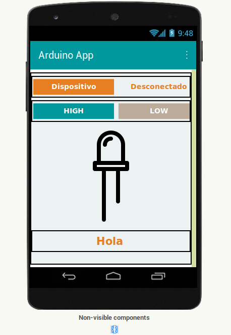
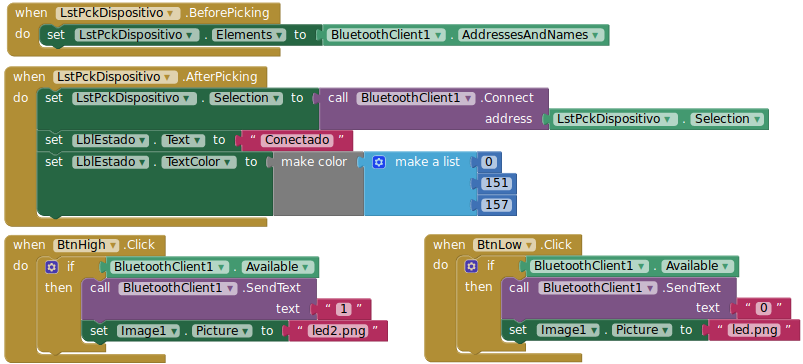

# arduino-appinventor
Repositorio de Arduino con AppInventor jornada Programador 2019.

## Aplicación App Inventor


<a href="Presentacion.apk" download>Descargar aplicación</a><br>
<a href="Presentacion.aia" download>Descargar Proyecto App Inventor</a><br>
<a href="conexion-con-appinventor.pdf" download>Descargar Presentación</a>
### Código App


## Código Arduino
```cpp
void setup() {
  
  Serial.begin(9600);

  pinMode(LED_BUILTIN, OUTPUT);
  
}

void loop()
{

  if (Serial.available())
  {
    char a = Serial.read();
    
    if (a == '1') {
      digitalWrite(LED_BUILTIN, HIGH);
    }else
    {
      digitalWrite(LED_BUILTIN, LOW);
    }
  }
  
}
```
